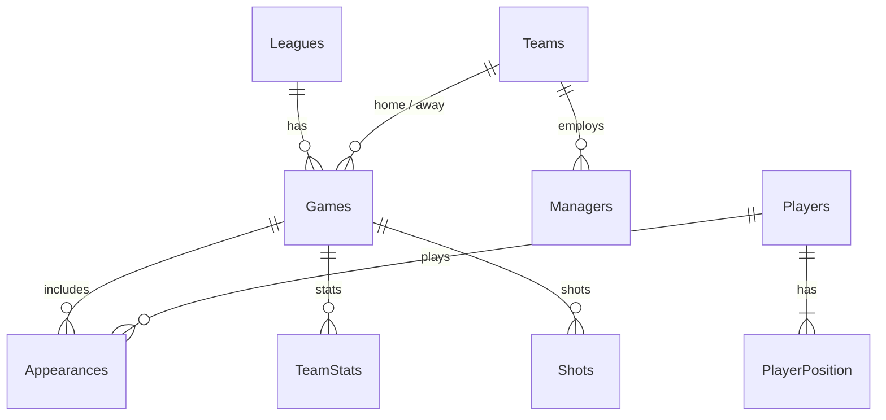

# Football Analytics

PostgreSQL database project for **football (soccer) match data**: leagues, teams, players, games, appearances, team statistics, and shot-level events. It includes **stored procedures**, **transaction demos**, a **trigger** that logs failed operations, and **analytical queries** over the loaded dataset.

<p align="center">
  
  
</p>

---

## Highlights

| Area | What you will find |
|------|-------------------|
| **Schema** | Normalized tables with foreign keys: `Leagues` → `Teams` / `Games` → `Appearances`, `TeamStats`, `Shots`, etc. |
| **Data** | CSV bulk loads via `\COPY` (paths relative to repo root). |
| **Procedures** | Add/update player + position, swap managers between teams, delete appearances by game. |
| **Transactions** | Example scripts that log success and failure into `TransactionEvents`; errors propagate to `TransactionLog` via trigger. |
| **Analysis** | `select_queries.sql` — goals, cards, managers by league, and player averages. |

**Data source:** [Football database on Kaggle](https://www.kaggle.com/datasets/technika148/football-database/data) (processed and cleaned for this project).

---

## Repository layout

```
├── README.md
├── data/                    # CSV files for \COPY
│   ├── leagues.csv
│   ├── teams.csv
│   ├── games.csv
│   ├── players.csv
│   ├── final_managers.csv
│   ├── final_appearances.csv
│   ├── final_playerposition_clean.csv
│   ├── final_teamlocations.csv
│   ├── final_teamstats_clean.csv
│   └── shots_final_no_duplicates.csv
├── notebooks/
│   └── appearance_split.ipynb   # data prep (appearances)
└── sql/
    ├── create.sql                 # DDL + transaction log tables
    ├── load.sql                   # bulk load (run from repo root)
    ├── trigger.sql                # log ERROR rows into TransactionLog
    ├── sp_add_player_with_position.sql
    ├── sp_swap_managers.sql
    ├── sp_delete_appearances_by_game.sql
    ├── DML_query.sql
    ├── select_queries.sql
    ├── success_transaction.sql
    └── failure_transaction.sql
```

---

## Prerequisites

- [PostgreSQL](https://www.postgresql.org/download/) **11+** (procedures use `CREATE PROCEDURE`; trigger syntax is standard).
- `psql` on your `PATH`.
- A database you are allowed to create objects in (e.g. `createdb football`).

---

## Quick start

**1. Clone and enter the repository**

```bash
git clone https://github.com/Sonawane07/Football-Analytics.git
cd Football-Analytics
```

**2. Create a database** (example)

```bash
createdb football
```

**3. Create tables**

```bash
psql -d football -f sql/create.sql
```

**4. Load data** — run `psql` **from the repository root** so `data/*.csv` paths in `load.sql` resolve correctly:

```bash
psql -d football -f sql/load.sql
```

**5. Optional: install trigger and demos**

Run in an order that matches your goal:

| Goal | Command |
|------|---------|
| Error logging trigger | `psql -d football -f sql/trigger.sql` |
| Stored procedures | `psql -d football -f sql/sp_add_player_with_position.sql` (and the other `sp_*.sql` files) |
| Sample DML | `psql -d football -f sql/DML_query.sql` |
| Analytics | `psql -d football -f sql/select_queries.sql` |
| Transaction demos | `psql -d football -f sql/success_transaction.sql` / `failure_transaction.sql` |

> **Tip:** For `\COPY`, the client reads files **relative to the current working directory** when you start `psql`, not relative to the `.sql` file. Always `cd` into the repo root before `-f sql/load.sql`.

---

## Entity overview



---

## Bonus (course work)

A **Power BI** dashboard was built on top of insights from this database (outside this repo).

---

## Authors

Course project — **Parth Sahastra**, **Darshan Sonawane**.

---

## License

This repository is shared for **educational and portfolio** use. The **underlying match data** remains subject to the **Kaggle dataset** terms; cite that source if you reuse the data.
